# Paper Note

[TOC]

## Skip N-grams and Ranking Functions for Predicting Script Events

原文链接：https://www.aclweb.org/anthology/E12-1034

***总结：*** 比较预测事件方式方法之间的差异与优劣，从三个方面入手：1）训练数据的选择；2）bigram方式；3）预测方法比较。最终评测的指标是：Average ranking和Recall@N。

***核心收获：*** 1）预测时不仅可以选择链的最后一个node作为预测目标，也可以选择其他链中node作为预测目标；2）评判标注可以参考Average ranking计算平均score。

***论文概述：*** 
* 需要比较的三个方面
    * 训练数据的选择
        * all：数据集形成的所有事件链
        * long：长度大于等于5的事件链
        * longest：每条数据中最长的事件链（根据actor不同划分事件链）
    * Bigram
        * Regular：相邻的trigger对
        * 1-Skip：regular+中间间隔1个的trigger对
        * 2-Skip：regula+1-Skip+中间间隔2个的trigger对
    * Method
        * PMI
        * Ordered PMI
        * Bigram

* Evaluation Method
    * Averge Ranking
    * Recall@N

公式1是```score```函数，可以理解为，在一条事件链中取第m个为```miss event```，也就是需要预测的，根据公式2计算待选event和链中其他node的```P```值，然后```log```求和，算出score，score小的更好。

公式3是average ranking，就是整合整个数据集所有链计算得到的```f(e,c)```进行平均，Recall@N就是计算数据集中```f(e,c)```小于某个阈值的事件占比。
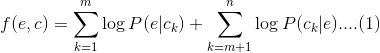
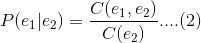
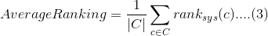
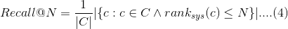

## A Structured Self-Attentive Sentence Embedding

原文链接：https://arxiv.org/abs/1703.03130

***总结：*** 介绍了LSTM+SelfAttention对句子进行分类的方法

***核心收获：*** 提供了方法构造的详细过程，主要通过学习这个来实现LSTM+SelfAttention进行句子分类的模型

***论文概述：***

* 词向量嵌入:(shape: n * d, d is embedding size, n is sentence length

    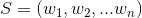

* 双向LSTM：将前后向结果拼接(shape: n * 2u, u is hidden size)

    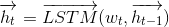
    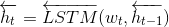
    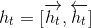
    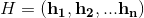

* attention weight：(shape: Ws1 da * 2u, Ws2 r * da  output r * 2 * hidden_size, linear wx+b)

    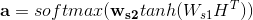
    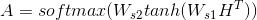

* last：之后拉平，fc layer全连接，之后label，+dropout batch norm

    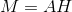

* penalization term：交叉熵


***Attention and Self Attention：***

详细参考：https://ldzhangyx.github.io/2018/10/14/self-attention/

从代码的角度理解：attention中bmm的一行，计算了lstm output 和最后一个隐向量的相似度，然后进行softmax，得到attention；self attention中，对lstm output 自己进行了相似度计算，谈后得到了attention

```
    def _attention_net(self, lstm_output):
        """
        Self-Attention layer
        :param lstm_output:
        :return:
        """
        # SELF ATTENTION
        attn_weight_matrix = self.W_s2(
            torch.tanh(self.W_s1(lstm_output)))  # batch_size x sequence_len x r ( attention hop)
        attn_weight_matrix = attn_weight_matrix.permute(0, 2, 1)  # batch_size x r x sequence_len
        attn_weight_matrix = F.softmax(attn_weight_matrix, dim=2)
        return attn_weight_matrix

        # ATTENTION EXAMPLE
        # input: lstm_output final_state(h_n)
        # use single direction so num_layers * num_directions == 1
        # final_state.size() = (num_layers * num_directions, batch, hidden_size)
        # lstm_output.size() = (batch_size, num_seq, hidden_size)
        # hidden.size() = (batch_size, hidden_size)
        # attn_weights.size() = (batch_size, num_seq)
        # soft_attn_weights.size() = (batch_size, num_seq)
        # new_hidden_state.size() = (batch_size, hidden_size)
        #
        # hidden = final_state.squeeze(0)
        # attn_weights = torch.bmm(lstm_output, hidden.unsqueeze(2)).squeeze(2)  # main difference toward self attention
        # soft_attn_weights = F.softmax(attn_weights, 1)
        # new_hidden_state = torch.bmm(lstm_output.transpose(1, 2), soft_attn_weights.unsqueeze(2)).squeeze(2)
        # return new_hidden_state
```

