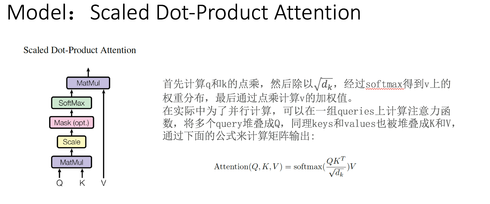
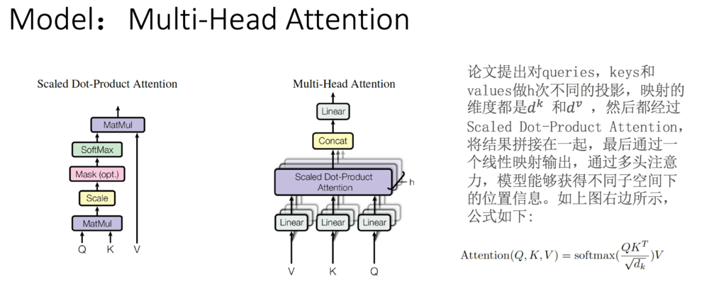
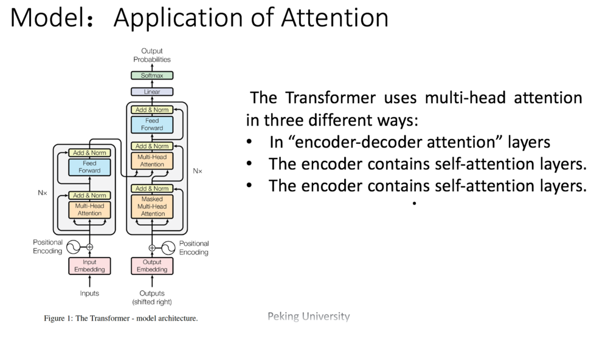
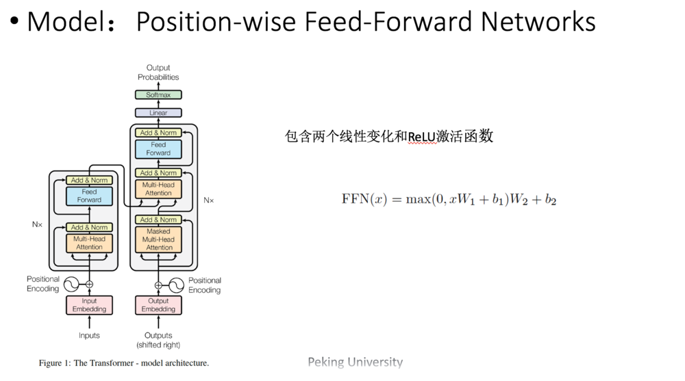
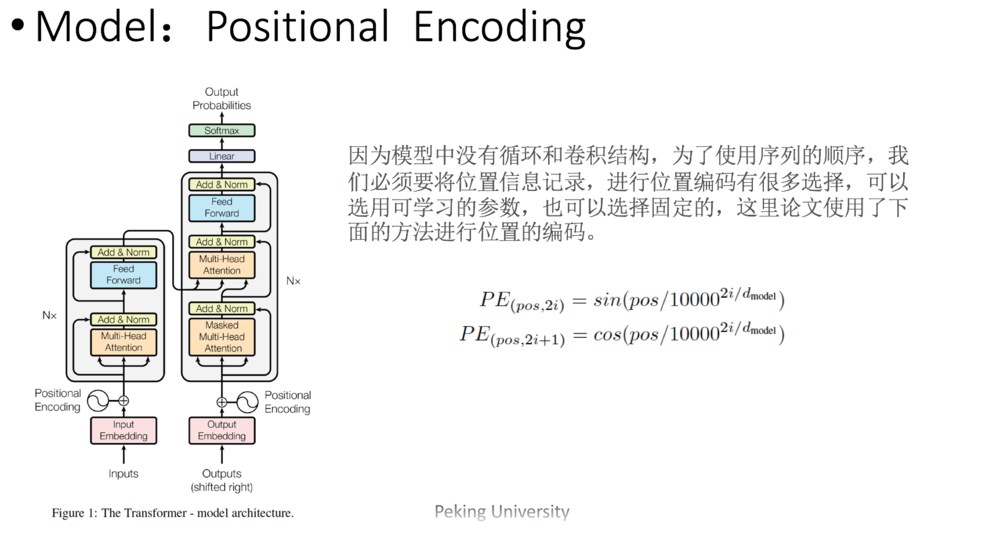
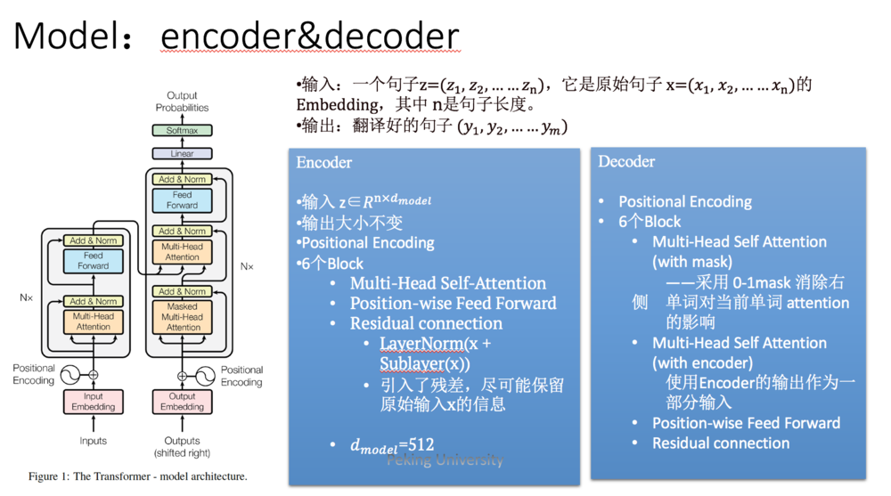

# Paper Note

[TOC]

## 1. Skip N-grams and Ranking Functions for Predicting Script Events

原文链接：[https://www.aclweb.org/anthology/E12-1034](https://www.aclweb.org/anthology/E12-1034)

***总结：*** 比较预测事件方式方法之间的差异与优劣，从三个方面入手：1）训练数据的选择；2）bigram方式；3）预测方法比较。最终评测的指标是：Average ranking和Recall@N。

***核心收获：*** 1）预测时不仅可以选择链的最后一个node作为预测目标，也可以选择其他链中node作为预测目标；2）评判标注可以参考Average ranking计算平均score。

***论文概述：***

* 需要比较的三个方面
  * 训练数据的选择
    * all：数据集形成的所有事件链
    * long：长度大于等于5的事件链
    * longest：每条数据中最长的事件链（根据actor不同划分事件链）
  * Bigram
    * Regular：相邻的trigger对
    * 1-Skip：regular+中间间隔1个的trigger对
    * 2-Skip：regula+1-Skip+中间间隔2个的trigger对
  * Method
    * PMI
    * Ordered PMI
    * Bigram

* Evaluation Method
  * Averge Ranking
  * Recall@N

公式1是```score```函数，可以理解为，在一条事件链中取第m个为```miss event```，也就是需要预测的，根据公式2计算待选event和链中其他node的```P```值，然后```log```求和，算出score，score小的更好。

公式3是average ranking，就是整合整个数据集所有链计算得到的```f(e,c)```进行平均，Recall@N就是计算数据集中```f(e,c)```小于某个阈值的事件占比。


## 2. A Structured Self-Attentive Sentence Embedding

原文链接：[https://arxiv.org/abs/1703.03130](https://arxiv.org/abs/1703.03130)

***总结：*** 介绍了LSTM+SelfAttention对句子进行分类的方法

***核心收获：*** 提供了方法构造的详细过程，主要通过学习这个来实现LSTM+SelfAttention进行句子分类的模型

***论文概述：***

* 词向量嵌入:(shape: n * d, d is embedding size, n is sentence length

    

* 双向LSTM：将前后向结果拼接(shape: n * 2u, u is hidden size)

    
    
    
    

* attention weight：(shape: Ws1 da x 2u, Ws2 r x da  output r x 2 x hidden_size, linear wx+b)

    
    

* last：之后拉平，fc layer全连接，之后label，+dropout batch norm

    

* penalization term：交叉熵

***Attention and Self Attention：***

详细参考：[https://ldzhangyx.github.io/2018/10/14/self-attention/](https://ldzhangyx.github.io/2018/10/14/self-attention/)

从代码的角度理解：attention中bmm的一行，计算了lstm output 和最后一个隐向量的相似度，然后进行softmax，得到attention；self attention中，对lstm output 自己进行了相似度计算，谈后得到了attention

```python
    def _attention_net(self, lstm_output):
        """
        Self-Attention layer
        :param lstm_output:
        :return:
        """
        # SELF ATTENTION
        attn_weight_matrix = self.W_s2(
            torch.tanh(self.W_s1(lstm_output)))  # batch_size x sequence_len x r ( attention hop)
        attn_weight_matrix = attn_weight_matrix.permute(0, 2, 1)  # batch_size x r x sequence_len
        attn_weight_matrix = F.softmax(attn_weight_matrix, dim=2)
        return attn_weight_matrix

        # ATTENTION EXAMPLE
        # input: lstm_output final_state(h_n)
        # use single direction so num_layers * num_directions == 1
        # final_state.size() = (num_layers * num_directions, batch, hidden_size)
        # lstm_output.size() = (batch_size, num_seq, hidden_size)
        # hidden.size() = (batch_size, hidden_size)
        # attn_weights.size() = (batch_size, num_seq)
        # soft_attn_weights.size() = (batch_size, num_seq)
        # new_hidden_state.size() = (batch_size, hidden_size)
        #
        # hidden = final_state.squeeze(0)
        # attn_weights = torch.bmm(lstm_output, hidden.unsqueeze(2)).squeeze(2)  # main difference toward self attention
        # soft_attn_weights = F.softmax(attn_weights, 1)
        # new_hidden_state = torch.bmm(lstm_output.transpose(1, 2), soft_attn_weights.unsqueeze(2)).squeeze(2)
        # return new_hidden_state
```

## 3. Attention Is All You Need

原文链接：[http://arxiv.org/abs/1706.03762](http://arxiv.org/abs/1706.03762)

参考资料:
[1] [论文笔记：Attention is all you need](https://www.jianshu.com/p/3f2d4bc126e6)

***总结：***  本文的创新点在于抛弃了之前传统的encoder-decoder模型必须结合cnn或者rnn的固有模式，只用attention。文章的主要目的是在减少计算量和提高并行效率的同时不损害最终的实验结果，创新之处在于提出了两个新的Attention机制，分别叫做 Scaled Dot-Product Attention 和 Multi-Head Attention.

***论文概述：***

### 传统encoder-decoder面临的问题

* 一般使用RNN
  * 难以处理长序列的句子：将所有必要信息压缩成 ***固定长度*** 的向量，使得神经网络难以应付 ***长时间的句子*** ，特别是那些比训练语料库中的句子更长的句子。
  * 无法实现并行：每个时间步的输出需要 ***依赖于前面时间步的输出*** ，这使得模型没有办法并行，效率低。
  * 面临对齐问题
    * 生成序列中的每个词与输入序列中一些词的对齐关系，这可以通过对标注 (annotations) 权重参数可视化来实现，每个图中矩阵的每一行表示与标注相关联的权重。由此我们可以看出在生成目标词时，源句子中的位置信息会被认为更重要。
    * 比如说英文翻译成中文，假设英文有10个词，对应的中文翻译只有6个词，那么就有了哪些英文词对哪些中文词的问题
* 改进RNN的方法
  * input的方向性 - 单向或双向
  * 深度 - 单层或多层
  * 类型– RNN，LSTM或GRU
* CNN方法
  * CNN不能直接用于处理变长的序列样本但可以 ***实现并行计算*** 。完全基于CNN的Seq2Seq模型虽然可以并行实现，但非常 ***占内存*** ，很多的trick，大数据量上参数 ***调整并不容易。***
* Attention Machine的引入
  * 由于无论输入如何变化， ***encoder给出的都是一个固定维数的向量*** ，存在信息损失；在生成文本时， ***生成每个词所用到的语义向量都是一样的*** ，这显然有些过于简单。为了解决上面提到的问题，一种可行的方案是引入Attention Machine。
  * 通过注意力机制，我们将输入句子编码为一个向量序列，并 ***自适应地选择这些向量的一个子集*** ，同时对译文进行译码，例如where are you——>你在哪？现在我们在翻译“你”的时候给"you"更多的权重，那么就可以有效的解决对齐问题。

### Attention

* Soft Attention

论文链接：[Neural machine translation by jointly learning to align and translate](https://arxiv.org/pdf/1409.0473.pdf)

这篇论文首先将注意力机制运用在NLP上，提出了soft Attention Model，并将其应用到了机器翻译上面。

所谓Soft，意思是在 ***求注意力分配概率分布的时候，对于输入句子X中任意一个单词都给出个概率*** ，是个概率分布。加入注意力机制的模型表现确实更好，但也存在一定问题，例如：attention mechanism通常和RNN结合使用，我们都知道RNN依赖t-1的历史信息来计算t时刻的信息，因此不能并行实现，计算效率比较低，特别是训练样本量非常大的时候。

* 基于CNN的Seq2Seq+Attention

优点是：基于CNN的Seq2Seq模型具有基于RNN的Seq2Seq模型捕捉long distance dependency的能力，此外，最大的优点是可以 ***并行化实现*** ，效率比基于RNN的Seq2Seq模型高。缺点： ***计算量与观测序列X和输出序列Y的长度成正比。***

### Transformer

Transformer 抛弃了RNN和CNN，transformer的主要特点包含以下三部分。

#### 1. Scaled Dot-Product Attention

有两种常用的注意力函数，一种是 ***加法注意力(additive attention)*** ，另外一种是 ***点乘注意力(dot-productattention)*** 。

论文所采用的就是 ***点乘注意力*** ，这种注意力机制对于加法注意力而言，***更快，同时更节省空间***。



这里把attention抽象为对 value() 的每个token进行加权，而加权的weight就是 attentionweight，而 ***attention weight 就是根据 query和 key 计算得到***，其意义为：

为了用 value求出 query的结果, 根据 query和 key 来决定注意力应该放在value的哪部分。***以前的 attention是用 LSTM 做 encoder，也就是用它来生成key 和 value，然后由 decoder来生成 query。***

具体到 Bahdanau 的论文 Neural machine translation by jointly learning to align and translate，***key 和 value是一样的，都是文中的h（lstm的引向量） ，而 query是文中的 s（sentence）。***

***为什么要乘以√1dk？*** 是因为如果d_k太大，点乘的值太大，如果不做scaling，结果就没有加法注意力好。另外，点乘的结果过大，这使得经过softmax之后的梯度很小，不利于反向传播的进行，所以我们通过对点乘的结果进行尺度化。

#### 2. Multi-Head Attention



Transformer会在三个不同的方面使用multi-headattention：

1. encoder-decoder attention：使用multi-head attention，输入为encoder的输出和decoder的self-attention输出，其中encoder的self-attention作为 key and value，decoder的self-attention作为query

2. encoder self-attention：使用 multi-head attention，输入的Q、K、V都是一样的（input embedding and positional embedding）

3. decoder self-attention：在decoder的self-attention层中，deocder 都能够访问当前位置前面的位置



#### 3. Position-wise Feed-Forward Networks

位置全链接前馈网络——MLP变形



用了两层Dense层，activation用的都是Relu。可以看成是两层的1*1的1d-convolution。hidden_size变化为：512->2048->512

Position-wise feed forward network，其实就是一个MLP 网络，1 的输出中，每个 d_model 维向量 x 在此先由  xW_1+b_1 变为 d_f 维的 x'，再经过max(0,x')W_2+b_2 回归 d_model 维。之后再是一个residual connection。输出 size 仍是 [sequence_length, d_model]

* 补充：MLP（Multi-Layer Perceptron）是一种前向结构的人工神经网络，映射一组输入向量到一组输出向量。MLP可以被看做是一个有向图，由多个节点层组成，每一层全连接到下一层。除了输入节点，每个节点都是一个带有非线性激活函数的神经元（或称处理单元）

#### 4. Positional Encoding



这样做的目的是因为正弦和余弦函数具有周期性，对于固定长度偏差k（类似于周期），post +k位置的PE可以表示成关于pos位置PE的一个线性变化（存在线性关系），这样可以方便模型学习词与词之间的一个相对位置关系。

#### 5. 模型整体概述



Transformer也会遵循这种结构，encoder和decoder都使用堆叠的self-attention和point-wise，fully connected layers。

Encoder: encoder由6个相同的层堆叠而成，每个层有两个子层。 ***第一个子层是多头自我注意力机制(multi-head self-attention mechanism)，第二层是简单的位置的全连接前馈网络(position-wise fully connected feed-forward network)。*** 在两个子层中会使用一个残差连接，接着进行层标准化( ***layer normalization*** )。也就是说每一个子层的输出都是LayerNorm(x + sublayer(x))。网络输入是 ***三个相同的向量q, k和v，是word embedding和position embedding相加得到的结果*** 。为了方便进行残差连接，我们需要子层的 ***输出和输入都是相同的维度。***

Decoder: decoder也是由N（N=6）个完全相同的Layer组成，decoder中的Layer由encoder的Layer中插入一个Multi-Head Attention + Add&Norm组成。 ***输出的embedding与输出的position embedding求和做为decoder的输入*** ，经过一个Multi-HeadAttention + Add&Norm（（MA-1）层，MA-1层的输出做为下一Multi-Head Attention + Add&Norm（MA-2）的query（Q）输入， ***MA-2层的Key和Value输入（从图中看，应该是encoder中第i（i = 1,2,3,4,5,6）层的输出对于decoder中第i（i = 1,2,3,4，5,6）层的输入）*** 。MA-2层的输出 ***输入到一个前馈层（FF），经过AN操作后，经过一个线性+softmax变换得到最后目标输出的概率。***

对于decoder中的第一个多头注意力子层，***需要添加masking，确保预测位置i的时候仅仅依赖于位置小于i的输出。***

层与层之间使用的Position-wise feed forward network。
